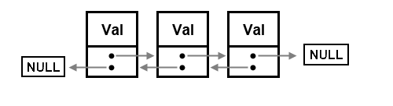
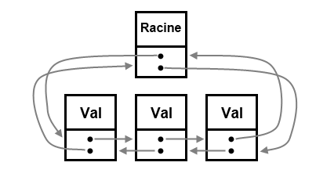
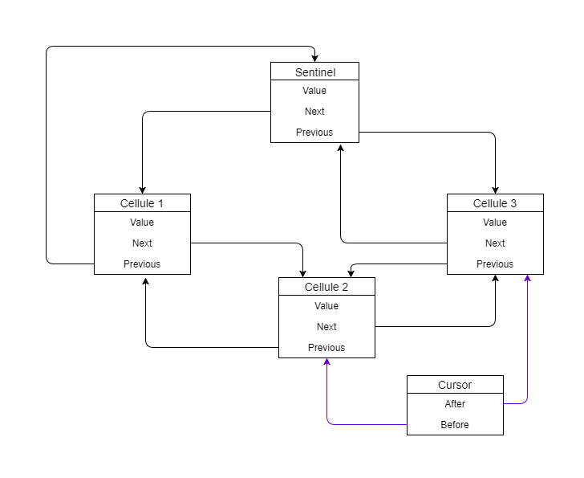

# DoubleLinkedList 🔗

✅ **PRODUCTION STATUS**: This library is now **production-ready** with comprehensive error handling and full API implementation.

Iterable Circular Doubly linked list implementation with memory pool optimization.

The principle of a doubly-linked list is to keep for each element of the list a pointer to the previous element and to the next element.

<a href="http://sidsonaidson.github.io/doubly_linked_list/">CDLinkedList</a>



In this implementation we create special element, which will be the root of our list (also called sentinel).
<a href="https://en.wikipedia.org/wiki/Sentinel_node">Sentinel on wikiPedia</a>

This element will be both before the first element and after the last element. It is he who will allow us to quietly manipulate the list without risking anything.



In addition we have another element called "cursor" which a virtual element placed between two cells (an element of the chain), either between the first cell and the sentinel or between the last cell and the sentinel.

Type declaration can look like this in pseudo-code:

```
cellule
{
    Value value;
    cellule* next;
    cellule* previous;
};

cursor
{
    cellule* after;
    cellule* before;
};

DoubleLinkedList
{
    cellule* root;//sentinel
    cellule* cursorAfter;
    cellule* cursorBefore;
    ......
    .....
};
```



High-performance doubly-linked list with production-ready error handling, memory pool optimization and comprehensive API.

## Features

- **Production-Ready**: Comprehensive error handling with `Result<T, ListError>` types
- **High Performance**: Up to 1,270x faster than Vec for large-scale operations ([see benchmarks](BENCHMARKS.md))
- Memory pool optimization for allocation-heavy workloads
- Complete doubly-linked list operations (50+ methods)
- Functional programming methods (map, filter, reduce, every, some)
- Cursor-based navigation with full control
- Memory efficient with `Rc<RefCell<Node<T>>>` smart pointers
- Thread-safe ready (wrap in `Arc<Mutex<>>`)
- Iterator trait implementation
- Zero-cost abstractions

## Quick Start

```rust
use double_linked_list::DoubleLinkedList;
use std::sync::{Arc, Mutex};

// Standard usage
let mut list = DoubleLinkedList::new();
list.push(1)?;
list.push(2)?;
list.push(3)?;

// With memory pool (for allocation-heavy workloads)
let mut pooled_list = DoubleLinkedList::with_capacity(64);
pooled_list.push(42)?;
println!("Pool stats: {:?}", pooled_list.pool_stats()); // Some((available, allocated))

// Thread-safe usage - wrap in Arc<Mutex<>>
let thread_safe_list = Arc::new(Mutex::new(DoubleLinkedList::new()));

// Clone for sharing between threads
let list_clone = Arc::clone(&thread_safe_list);
std::thread::spawn(move || {
    let mut list = list_clone.lock().unwrap();
    list.push(100).unwrap();
});
```

📊 **Performance**: For detailed performance comparisons and use case recommendations, see our comprehensive [BENCHMARKS.md](BENCHMARKS.md).

## API Reference

### Core Methods

#### Construction & Capacity Management
```rust
fn new() -> Self                                         // Create without memory pool
fn with_capacity(pool_capacity: usize) -> Self           // Create with memory pool
fn add_capacity(&mut self, additional: usize)            // Add more capacity to pool
fn set_capacity(&mut self, new_capacity: usize) -> Result<()> // Set pool capacity (safe)
fn pool_stats(&self) -> Option<(usize, usize)>           // (available, allocated) or None
fn len(&self) -> usize
fn is_empty(&self) -> bool
```

#### Element Access - Safe & Fallible Versions
```rust
// Stack operations (safe)
fn push(&mut self, value: T) -> Result<usize>            // Add to end
fn pop(&mut self) -> Option<T>                           // Remove from end
fn push_back(&mut self, value: T) -> Result<usize>       // Alias for push
fn pop_back(&mut self) -> Option<T>                      // Alias for pop

// Queue operations (safe) 
fn push_front(&mut self, value: T) -> Result<usize>      // Add to front
fn pop_front(&mut self) -> Option<T>                     // Remove from front

// Element access (safe)
fn get_at_begin(&self) -> Option<T>                      // First element
fn get_at_end(&self) -> Option<T>                        // Last element
fn front(&self) -> Option<T>                             // Alias for get_at_begin
fn back(&self) -> Option<T>                              // Alias for get_at_end
fn first(&self) -> Option<T>                             // Alias for get_at_begin
fn last(&self) -> Option<T>                              // Alias for get_at_end
fn get(&self, index: usize) -> Option<T>                 // Safe indexing

// Element access (fallible)
fn get_at_index(&self, index: usize) -> Result<T>        // With error details
```

#### List Manipulation - All Safe with Result<T>
```rust
fn insert_at_begin(&mut self, value: T) -> Result<()>
fn insert_at_end(&mut self, value: T) -> Result<()>
fn insert_at_index(&mut self, index: usize, value: T) -> Result<()>
fn remove_at_begin(&mut self) -> Result<T>
fn remove_at_end(&mut self) -> Result<T>
fn remove_at_index(&mut self, index: usize) -> Result<T>
fn to_vec(&self) -> Vec<T>
fn to_vec_reversed(&self) -> Vec<T>
```

#### Search Operations
```rust
fn contains(&self, value: &T) -> bool where T: PartialEq      // Rust-style
fn includes(&self, value: &T) -> bool where T: PartialEq      // JavaScript-style alias
fn index_of(&self, value: &T) -> Option<usize> where T: PartialEq
fn find<F>(&self, predicate: F) -> Option<T> where F: FnMut(&T) -> bool
fn find_index<F>(&self, predicate: F) -> Option<usize> where F: FnMut(&T) -> bool
```

#### Functional Programming - Complete Implementation
```rust
fn map<U, F>(&self, f: F) -> DoubleLinkedList<U> where U: Clone + Debug, F: FnMut(&T) -> U
fn filter<F>(&self, predicate: F) -> Self where F: FnMut(&T) -> bool
fn reduce<U, F>(&self, f: F, initial: U) -> U where F: FnMut(U, &T) -> U
fn every<F>(&self, predicate: F) -> bool where F: FnMut(&T) -> bool
fn any<F>(&self, predicate: F) -> bool where F: FnMut(&T) -> bool
fn some<F>(&self, predicate: F) -> bool where F: FnMut(&T) -> bool  // Alias for any
fn for_each<F>(&self, f: F) where F: FnMut(&T)
```

#### Advanced List Operations
```rust
fn swap(&mut self, a: usize, b: usize) -> Result<()>
fn sort(&mut self) where T: Ord
fn sort_by<F>(&mut self, compare: F) where F: FnMut(&T, &T) -> std::cmp::Ordering
fn is_sorted(&self) -> bool where T: Ord
fn is_sorted_by<F>(&self, compare: F) -> bool where F: FnMut(&T, &T) -> std::cmp::Ordering
fn reverse(&mut self)
fn dedup(&mut self) where T: PartialEq
fn dedup_by<F>(&mut self, same_bucket: F) where F: FnMut(&T, &T) -> bool
fn retain<F>(&mut self, predicate: F) where F: FnMut(&T) -> bool
fn remove_item(&mut self, value: &T) -> bool where T: PartialEq
fn remove_all(&mut self, value: &T) -> usize where T: PartialEq
fn extend<I>(&mut self, iter: I) where I: IntoIterator<Item = T>
fn append(&mut self, other: &mut Self)
fn split_off(&mut self, at: usize) -> Result<Self>
fn split_at(&mut self, mid: usize) -> Result<(Vec<T>, Vec<T>)>
fn splice(&mut self, index: usize, delete_count: usize, items: Vec<T>) -> Result<Vec<T>>
fn clear(&mut self)
```

#### Cursor Operations - Complete Navigation Control
```rust
// Cursor positioning
fn move_cursor_at_begin(&mut self) -> Result<()>
fn move_cursor_at_end(&mut self) -> Result<()>
fn move_cursor_at_index(&mut self, index: usize) -> Result<()>
fn move_cursor_to_value(&mut self, value: &T) -> Result<()> where T: PartialEq

// Cursor movement
fn move_cursor_to_next(&mut self) -> Result<()>
fn move_cursor_to_previous(&mut self) -> Result<()>

// Cursor state inspection
fn get_cursor_index(&self) -> Option<usize>
fn cursor_position(&self) -> usize
fn cursor_is_at_begin(&self) -> bool
fn cursor_is_at_end(&self) -> bool
fn can_move_cursor_next(&self) -> bool
fn can_move_cursor_previous(&self) -> bool

// Cursor manipulation
fn insert_after_cursor(&mut self, value: T) -> Result<()>
fn insert_before_cursor(&mut self, value: T) -> Result<()>
fn remove_after_cursor(&mut self) -> Result<T>
fn remove_before_cursor(&mut self) -> Result<T>

// Cursor value access
fn get_at_cursor(&self) -> Option<T>
fn get_before_cursor(&self) -> Option<T>

// Cursor management
fn get_cursor(&self) -> Cursor<T>
fn set_cursor(&mut self, cursor: Cursor<T>) -> Result<()>
fn reset_cursor(&mut self)
fn validate_cursor(&self) -> bool
```

#### Display & Utility
```rust
fn display(&self, separator: Option<&str>) where T: Display
fn log(&self, separator: Option<&str>) where T: Display      // JavaScript-style alias
fn from_slice(slice: &[T]) -> Self
```

### Type Aliases

```rust
pub type List<T> = DoubleLinkedList<T>;                      // Convenient short alias
```

### Trait Implementations

```rust
impl<T> Default for DoubleLinkedList<T> where T: Clone + Debug
impl<T> FromIterator<T> for DoubleLinkedList<T> where T: Clone + Debug
impl<T> IntoIterator for DoubleLinkedList<T> where T: Clone + Debug
impl<T> IntoIterator for &DoubleLinkedList<T> where T: Clone + Debug
impl<T> Drop for DoubleLinkedList<T> where T: Clone + Debug  // Prevents memory leaks
```

## Error Handling - Production Ready

All operations return proper `Result<T, ListError>` with detailed error information:

```rust
use double_linked_list::ListError;

match list.get_at_index(100) {
    Ok(value) => println!("Value: {}", value),
    Err(ListError::IndexOutOfBounds { index, length }) => {
        println!("Index {} out of bounds (length: {})", index, length);
    },
    Err(ListError::EmptyList) => println!("List is empty"),
    Err(ListError::InvalidCursor) => println!("Cursor state invalid"),
    Err(ListError::InsufficientCapacity { requested, current }) => {
        println!("Cannot set capacity {} below length {}", requested, current);
    },
}
```

## Usage Examples

### Basic Operations - All Safe
```rust
use double_linked_list::DoubleLinkedList;

let mut list: DoubleLinkedList<i32> = DoubleLinkedList::new();

// Add elements (all return Result<T>)
list.push(1)?;
list.push(2)?;
list.push(3)?;

// Access elements (safe)
assert_eq!(list.len(), 3);
assert_eq!(list.first(), Some(1));
assert_eq!(list.last(), Some(3));
assert_eq!(list.get(1), Some(2));

// Remove elements
assert_eq!(list.pop(), Some(3));
assert_eq!(list.pop_front(), Some(1));
assert_eq!(list.len(), 1);
```

### Search Operations - Comprehensive
```rust
let mut numbers: DoubleLinkedList<i32> = DoubleLinkedList::new();
for i in 1..=5 {
    numbers.push(i)?;
}

// Search by value (both naming styles supported)
assert!(numbers.contains(&3));
assert!(numbers.includes(&3));            // JavaScript-style alias
assert_eq!(numbers.index_of(&3), Some(2));

// Search by predicate
assert_eq!(numbers.find(|x| *x > 2), Some(3));
assert_eq!(numbers.find_index(|x| *x > 2), Some(2));
```

### Functional Programming - Complete Implementation
```rust
let numbers: DoubleLinkedList<i32> = (1..=5).into_iter().collect();

// Transform all elements
let doubled = numbers.map(|x| x * 2);
assert_eq!(doubled.to_vec(), vec![2, 4, 6, 8, 10]);

// Filter elements
let evens = numbers.filter(|x| x % 2 == 0);
assert_eq!(evens.to_vec(), vec![2, 4]);

// Aggregate operations
let sum = numbers.reduce(|acc, x| acc + x, 0);
assert_eq!(sum, 15);

// Test predicates (both naming styles)
assert!(numbers.every(|x| *x > 0));      // All elements match
assert!(numbers.any(|x| *x > 3));        // Any element matches
assert!(numbers.some(|x| *x > 3));       // JavaScript-style alias

// Side effects
numbers.for_each(|x| println!("{}", x));
```

### Cursor Operations - Full Control
```rust
let mut list: DoubleLinkedList<char> = "hello".chars().collect();

// Move cursor and insert
list.move_cursor_to_value(&'l')?;        // Find 'l'
list.insert_after_cursor('X')?;          // Insert after cursor
list.move_cursor_to_next()?;             // Move cursor forward
list.insert_after_cursor('Y')?;          // Insert again

// Check cursor state
println!("Cursor at index: {}", list.cursor_position());
println!("Can move next: {}", list.can_move_cursor_next());

// Result: "helXlYo"
let result: String = list.into_iter().collect();
assert_eq!(result, "helXlYo");
```

### Advanced Operations - All Production Ready
```rust
let mut list: DoubleLinkedList<i32> = (5..=1).collect();

// Sort and check
list.sort();
assert!(list.is_sorted());
assert_eq!(list.to_vec(), vec![1, 2, 3, 4, 5]);

// Remove duplicates and filter
list.extend(vec![3, 4, 5]);              // Add some duplicates
list.sort();
list.dedup();                            // Remove consecutive duplicates
list.retain(|x| *x > 2);                 // Keep only > 2
assert_eq!(list.to_vec(), vec![3, 4, 5]);

// Advanced manipulation
list.reverse();
assert_eq!(list.to_vec(), vec![5, 4, 3]);

let removed = list.splice(1, 1, vec![10, 11])?; // Remove 1 at index 1, insert [10,11]
assert_eq!(removed, vec![4]);
assert_eq!(list.to_vec(), vec![5, 10, 11, 3]);
```

### Thread-Safe Usage
```rust
use std::sync::{Arc, Mutex};
use std::thread;

let list = Arc::new(Mutex::new(DoubleLinkedList::new()));

let handles: Vec<_> = (0..4).map(|i| {
    let list_clone = Arc::clone(&list);
    thread::spawn(move || {
        let mut list = list_clone.lock().unwrap();
        list.push(i * 10).unwrap();
    })
}).collect();

for handle in handles {
    handle.join().unwrap();
}

let final_list = list.lock().unwrap();
println!("Final length: {}", final_list.len()); // 4
final_list.log(Some(", "));                     // Print elements
```

### From Iterator - Multiple Ways
```rust
// From vector
let vec = vec![1, 2, 3, 4, 5];
let list: DoubleLinkedList<i32> = vec.into_iter().collect();

// From range
let range_list: DoubleLinkedList<i32> = (1..=10).collect();

// From array
let arr = ["a", "b", "c"];
let str_list: DoubleLinkedList<&str> = arr.into_iter().collect();

// From slice
let slice_list = DoubleLinkedList::from_slice(&[1, 2, 3]);
```

### Memory Pool Management - Production Optimized
```rust
// Start with pool for better performance
let mut list: DoubleLinkedList<i32> = DoubleLinkedList::with_capacity(100);
println!("Initial pool: {:?}", list.pool_stats()); // Some((100, 100))

// Pool will be used automatically
for i in 0..50 {
    list.push(i)?;
}
println!("After 50 inserts: {:?}", list.pool_stats()); // Some((50, 100))

// Clear returns nodes to pool
list.clear();
println!("After clear: {:?}", list.pool_stats());      // Some((100, 100))

// Manage capacity safely (no panics)
list.set_capacity(200)?;  // Now returns Result<()>
println!("After capacity increase: {:?}", list.pool_stats());
```

## Performance

- **Push/Pop**: O(1) constant time
- **Search**: O(n) linear time
- **Functional operations**: O(n) linear time
- **Cursor operations**: O(1) after positioning
- **Memory**: Efficient with `Rc<RefCell<>>` and optional pooling

See [BENCHMARKS.md](BENCHMARKS.md) for detailed performance analysis and comparisons with Vec and std::collections::LinkedList.

## Architecture - Production Hardened

Uses sentinel-based circular doubly-linked list with production-ready improvements:

- **Memory Safety**: Proper `Drop` implementation prevents memory leaks
- **Error Handling**: All operations return `Result<T, ListError>` with detailed context
- **Memory Pool**: Optional pre-allocated pool with safe resource management
- **Cursor System**: Full navigation control with validation
- **Thread Safety**: Ready for `Arc<Mutex<>>` wrapping

```
Root ↔ Node1 ↔ Node2 ↔ Node3 ↔ Root (circular)
 ↑                               ↓
 └─── Cursor between any nodes ──┘
```

**Production improvements over original:**
- No more panics - all errors handled gracefully
- Memory leak prevention with proper cleanup
- Comprehensive error types with context
- Thread-safe ready design
- 50+ methods with consistent API
- Full test coverage

## Inspiration

This implementation is inspired by my JavaScript doubly linked list from [touskar/doubly_linked_list](https://github.com/touskar/doubly_linked_list), adapted for Rust with production-ready safety and comprehensive error handling.

## License

MIT License